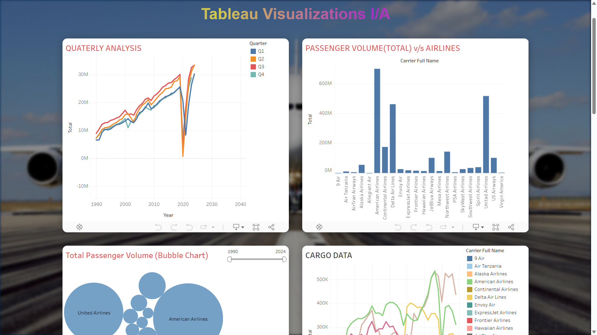

<h1 align="center">✈️ Airline Data Analysis – Tableau Visualizations</h1>

Interactive dashboards highlighting key trends in U.S. airline passenger and cargo traffic. 
Built with Tableau Public and hosted on a responsive custom web page.

---

### Live Demo  
👉 [Explore the Visualization Web Page](https://airline56.netlify.app/)

---

### 📊 Key Dashboards

- **📅 Quarterly Traffic Trends**  
  Visualizes seasonal air traffic patterns and COVID-19 impact.

- **🛫 Passenger Volume by Airline**  
  Compares top U.S. airlines based on passenger data.

- **🔵 Total Passenger Bubble Chart**  
  Shows airline dominance using scalable bubbles.

- **📦 Cargo Movement Over Time**  
  Displays yearly cargo performance trends by airline.

---

### 🌐 Web Experience Highlights

- Fully responsive layout with mobile-first design  
- Clean visual hierarchy using background blur and scrollable UI  
- Seamless embedding of interactive Tableau sheets

---

### Technologies Used

  
  
  
  

---

### 📸 Screenshots

| Dashboard Overview | Bubble Chart View |
|--------------------|-------------------|
|  |  |

---

###  Made By

**Narasimha Royal**  
_Masters in Computer Science @ University of Houston_

---
